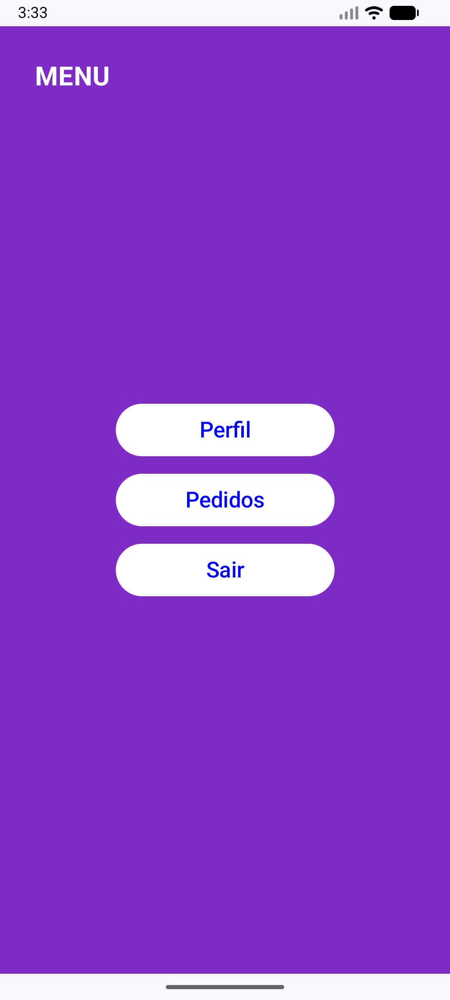

## App de Navegação - Android

Exercicio - Aplicativo simples desenvolvido utilizando Kotlin e Jetpack Compose, com navegação entre
telas.

📱 Telas do aplicativo

Login e Menu

  
  

Perfil e Pedidos

  
  

Atualização - Passagem de Parâmetros

Foram implementadas diferentes formas de navegação com envio de dados entre telas, incluindo
parâmetros obrigatórios, opcionais, simples e múltiplos.

Perfil com parâmetros e Pedidos com parâmetro opcional:

-Exemplos utilizando valores fictícios como "Fulano de tal" e "25 anos" e "Cliente XPTO":

  
  

🛠 Tecnologias utilizadas

- Kotlin
- Android Studio
- Jetpack Compose
- Navigation Compose

👩‍💻 Autora
Giovana Santos